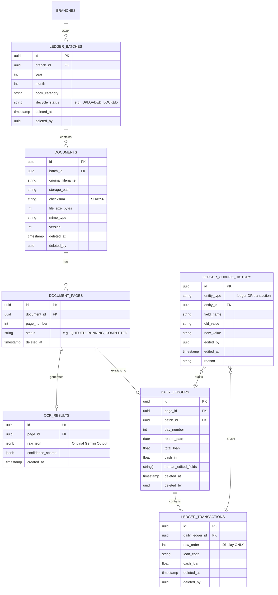

# Enterprise V2 Data Model & Business Rules

This document outlines the proposed Entity Relationship Diagram (ERD) and formalized business rules for the Enterprise V2 rewrite of the Ledger Automation System. **No code or schema migrations will begin until this model is fully approved.**

## 1. Entity Relationship Diagram (ERD)

The following schema restructures the database to support multi-part documents, strict audit trails, immutable OCR data, soft deletes, and transaction UUIDs.

---

## 2. Formal Business Rules

### 2.1 File Immutability & Validation (Issue 1, Issue 4, Issue 5)
1. **No Upserts on Original Documents:** PDF uploads strictly insert new `DOCUMENTS` rows. If a scan is repeated, it creates a new `version`. Accidental overwrite of historical scans is physically impossible.
2. **Checksum Integrity:** Every uploaded PDF must have a calculated SHA256 `checksum`, `file_size_bytes`, and `mime_type`. Downloads must verify this checksum to prevent silent corruption.
3. **Multi-Part Batches:** A single `LEDGER_BATCH` (e.g., Kiribathgoda, Jan 2025, L-Book) can contain *multiple* `DOCUMENTS` (Part 1, Part 2). 

### 2.2 OCR Isolation & Confidence (Issue 2, Issue 6, Issue 11)
4. **Immutable OCR JSON:** Gemini OCR responses are stored purely in the `OCR_RESULTS` table and are never mutated. 
5. **Page-Level Granularity:** OCR status (`QUEUED`, `RUNNING`, `FAILED`, `COMPLETED`) is tracked at the `DOCUMENT_PAGES` level. If a crash occurs at Page 17, only Page 17 fails.
6. **Confidence Thresholding:** The `OCR_RESULTS` table stores confidence percentages. The UI will automatically highlight fields with `< 90%` confidence to guide human reviewers.

### 2.3 Workflow Lifecycle (Enterprise Feature, Issue 7)
7. **Strict State Machine:** Documents enforce a rigid lifecycle constraint: 
   `UPLOADED` -> `VALIDATING` -> `READY FOR OCR` -> `OCR PROCESSING` -> `OCR COMPLETE` -> `HUMAN REVIEW` -> `CHANGES REQUIRED` -> `REVIEW COMPLETE` -> `VERIFIED` -> `LOCKED` -> `ARCHIVED`.
8. **Percentage Processing:** Overall batch progress is computed mathematically based on the exact status of its child `DOCUMENT_PAGES`, removing arbitrary `processing` string statuses.

### 2.4 Auditing & Protection (Issue 3, Issue 8, Issue 14)
9. **Permanent Audit Log:** Every human modification to a financial value inside `DAILY_LEDGERS` or `LEDGER_TRANSACTIONS` automatically inserts a row into `LEDGER_CHANGE_HISTORY` detailing `old_value`, `new_value`, `edited_by`, and `reason`.
10. **Transaction UUIDs:** The `LEDGER_TRANSACTIONS` table uses UUIDs as primary keys. `row_order` is strictly for UI display to prevent shifting collisions.
11. **Soft Deletion:** Standard `DELETE` queries are banned for financial records. Records are flagged with `deleted_at` and `deleted_by`.

### 2.5 Security & Disaster Recovery (Issue 9, Issue 10)
12. **Mandatory Branch Isolation:** Every Row-Level Security (RLS) policy and database query must explicitly filter by `branch_id`. `SELECT *` without a branch context is rejected.
13. **Active Recovery Service:** A dedicated recovery service will detect split-brain scenarios (e.g., "Database record exists but Storage file is missing") and provide administrative tools to patch or flag missing links.

## User Approval Required
Please review the ERD and Business Rules above. Does this architecture accurately capture all your requirements for V2? Let me know if anything needs adjustment before we formulate the migration plan.
